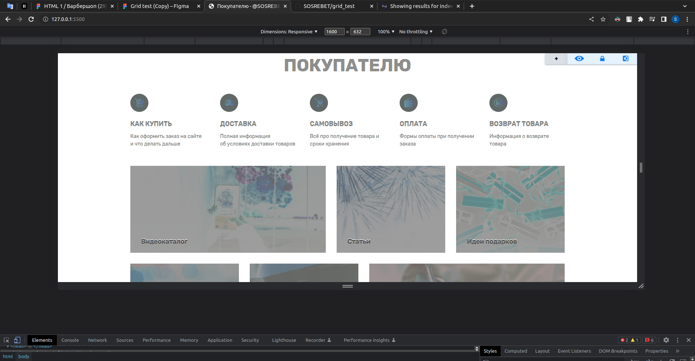
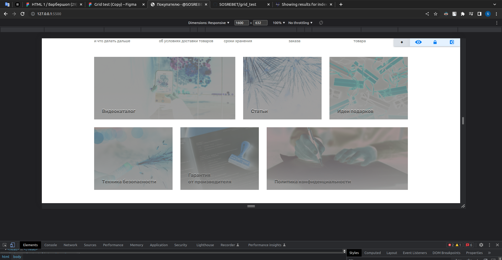
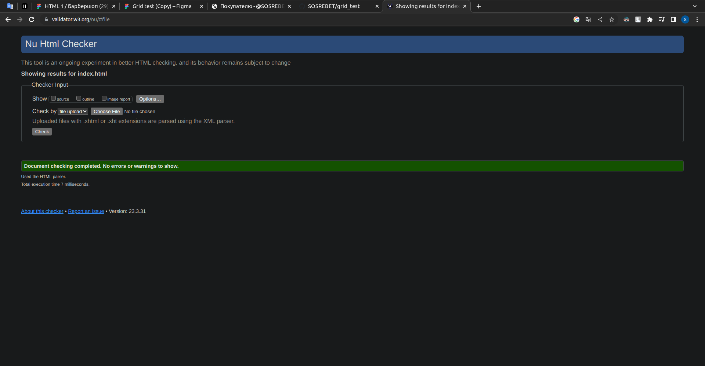

# Grid test

> Работа с исправленными ошибками и адаптивной сеткой для 425px находится на ветке [adaptive](https://github.com/SOSREBET/grid_test/tree/adaptive).

 

Выполнил работу с помощью grid-layout (без flex-ов).

# Сравнение №1 в PerfectPixel

# Сравнение №2 в PerfectPixel

# Проверка в validator.w3.org

_[Выполнил @SOSREBET](https://t.me/SOSREBET)_
